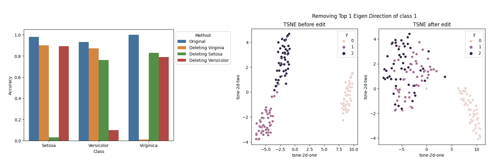
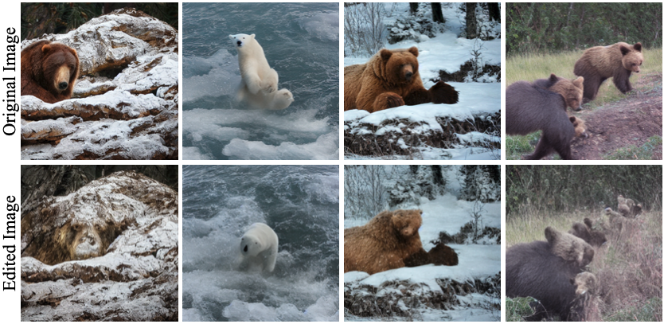
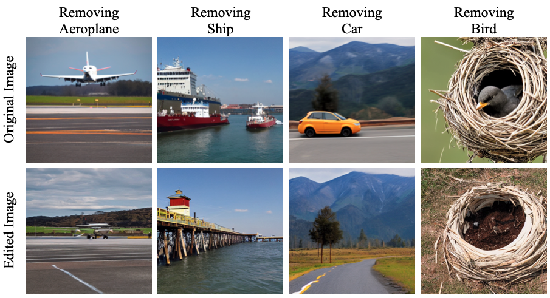

# Importance of Eigen Directions in Deep Neural Networks 
Editing memory of large neural network models has been gaining a lot of attention with the recent advancements in Large Language Models (LLMs) and diffusion models. From copyright image take-downs to inappropriate image restrictions, memory editing has a wide variety of crucial applications for safer AI practices. 
In this work, we address the task of memory editing in vision models through interventions. We also show that the attention heads in diffusion models act as a memory bank for concepts. By editing the knowledge of the models through intervention, one can avoid the overhead of expensive retraining of the large models.

We find that probing the activations and removing the eigen directions of a particular class' activations can lead to selective memory erasure from the models (especially with fully connected linear layers). We believe that FC layers are the memory banks of the deep neural networks.  

## Diffusion Models
Since, attentions in diffusion models are essentially FC layers, we try and edit the eigen directions of these layers. We find that it leads to indirect editing of model's knowledge of a concept. 

We also find that this type of editing can be easily circumvented. Therefore finetuning the model weights similar to ["Erasing Concepts from Diffusion Models"](https://erasing.baulab.info) can lead to a finer and controllable effects. 

